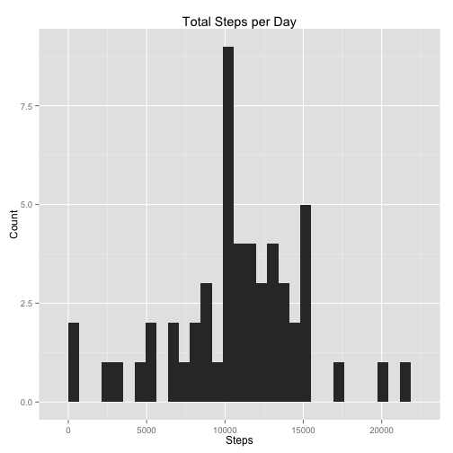
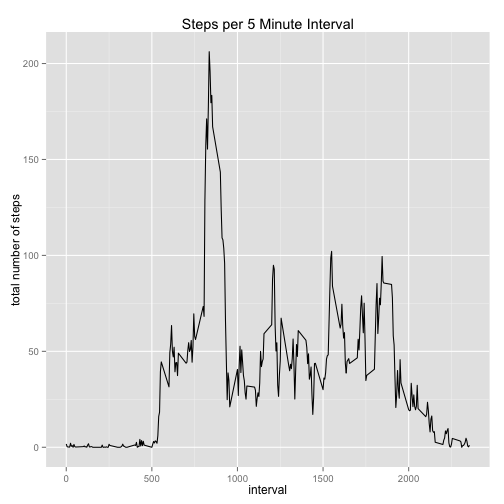
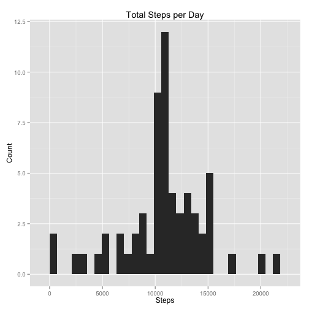
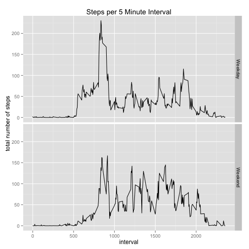

# Reproducible Research: Peer Assessment 1
This project mines data from a device that counts the number of steps the wearer takes.  Each row contains the number of steps taken on a particular day in a specific five minute interval.

## Loading and preprocessing the data
The data file (activity.zip) was included in the forked repo.  Since it doesn't have to be downloaded it's simple to unzip it and read it into the variable `act`:


```r
###### Initialization
## Load required libraries
stopifnot(require(dplyr))
stopifnot(require(ggplot2))

## Read in the data and massage it to the desired formats/factors
zipName <- "./activity.zip"
unzip(zipName)
fileName <- "./activity.csv"
act <- read.csv(fileName, 
                header = TRUE, 
                na.strings = "NA", 
                colClasses = c("integer", "character", "integer"))
act$date <- as.Date(act$date, "%Y-%m-%d")
act$date <- as.factor(act$date)
```

## What is mean total number of steps taken per day?
I find that the _dplyr_ package makes it very simply to calculate aggregates across subsets.  In this case we first use the `summarise()` function to calculate the total number of steps taken per day, then take the mean and median of those steps:

```r
###### Total number of steps per day
## get the total per day and plot it as a histogram
act.no_na <- na.omit(act)  # get rid of all NA values
steps.total <- summarise(group_by(act.no_na,date), sum(steps))
names(steps.total)[2] <- "total"
qplot(steps.total[, 2], 
      data = steps.total, 
      geom="histogram", 
      xlab="Steps", 
      ylab="Count",
      main="Total Steps per Day")
```

 

The mean number of steps per day (ignoring NAs) is:

```r
mean(steps.total[, 2])
```

```
## [1] 10766
```

and the median number of steps per day (ignoring NAs) is:

```r
median(steps.total[, 2])
```

```
## [1] 10765
```

## What is the average daily activity pattern?
The dataset lists the number of steps taken in five minute intervals.  We can average the number of steps in each discrete interval using the following code:

```r
steps.interval <- summarise(group_by(act.no_na, interval), mean(steps))
names(steps.interval)[2] <- "total"
ggplot(steps.interval, aes(interval, total)) +
  geom_line() +
  ylab("total number of steps") +
  ggtitle("Steps per 5 Minute Interval")
```

 

Now it's a simple matter to find the interval with the most steps:

```r
si.max <- max(steps.interval[, 2])                # max number of steps in an interval
steps.interval[steps.interval$total == si.max, 1] # interval with that max
```

```
## [1] 835
```

## Inputing missing values
The original data set (in `act`) contained some rows with NA values in the _step_ column.  `act.no_na` was created by omitting (`na.omit()`) all rows that had NA values.  To find the number of rows with NA, simple subtract the number of rows in `act.no_na` from `act`:


```r
nrow(act) - nrow(act.no_na)
```

```
## [1] 2304
```

To fix the missing values, the strategy I'll be using is to replace NA values in a specific interval with the average number of steps in that interval:


```r
b <- filter(act, is.na(act$steps)) # get only NA values
b[b$interval == steps.interval$interval, 1] <- steps.interval[, 2]
a <- filter(act, !is.na(act$steps))
acta <- rbind(a, b)
```

Now we can recreate the histogram from above with all the new values: 

```r
###### Total number of steps per day
## get the total per day and plot it as a histogram
steps.totalb <- summarise(group_by(acta,date), sum(steps))
names(steps.totalb)[2] <- "total"
qplot(steps.totalb[, 2], 
      data = steps.totalb, 
      geom="histogram", 
      xlab="Steps", 
      ylab="Count",
      main="Total Steps per Day")
```

```
## stat_bin: binwidth defaulted to range/30. Use 'binwidth = x' to adjust this.
```

 

The mean number of steps per day (with interpolated values for the NAs) is:

```r
mean(steps.totalb[, 2])
```

```
## [1] 10766
```

and the median number of steps per day (with interpolated values for the NAs) is:

```r
median(steps.totalb[, 2])
```

```
## [1] 10766
```

Note that these are (almost) the same values as when omitting NAs.  This does not appear to be an error, because if we calculate the mean manually (sum of steps divided by number of rows) for each you can see that despite the sums and rows being different the means are identical:

```r
nrow(steps.total)
```

```
## [1] 53
```

```r
sum(steps.total[, 2])
```

```
## [1] 570608
```

```r
sum(steps.total[, 2])/nrow(steps.total)
```

```
## [1] 10766
```

```r
nrow(steps.totalb)
```

```
## [1] 61
```

```r
sum(steps.totalb[, 2])
```

```
## [1] 656738
```

```r
sum(steps.totalb[, 2])/nrow(steps.totalb)
```

```
## [1] 10766
```

## Are there differences in activity patterns between weekdays and weekends?
It is further possible to chart the number of steps per interval, broken down into weekend versus weekday steps.  As you can see from the following plot on weekdays there is a large spike around interval 800, then low levels of activity until around interval 1900; on the weekends the inititial spike is lower, and the level of activity through the day is higher, tapering off after interval 2000.


```r
###### Show Weekend version Weekday Activity Patterns
## Add a factor column for weekend versus weekdays
acta$date <- as.Date(acta$date)
acta$weekdays <- weekdays(acta$date)
d <- filter(acta, acta$weekdays %in% c("Monday", "Tuesday", "Wednesday", "Thursday", "Friday"))
d$weekend <- "Weekday"
e <- filter(acta, acta$weekdays %in% c("Saturday", "Sunday"))
e$weekend <- "Weekend"
acta <- rbind(d, e)
acta$weekend <- factor(acta$weekend)

## Plot the data: weekend versus weekday steps
steps.interval.weekend <- summarise(group_by(acta, interval, weekend), mean(steps))
names(steps.interval.weekend)[3] <- "total"
ggplot(steps.interval.weekend, aes(interval, total)) +
  geom_line() +
  facet_grid(weekend ~ .) +
  ylab("total number of steps") +
  ggtitle("Steps per 5 Minute Interval")
```

 
